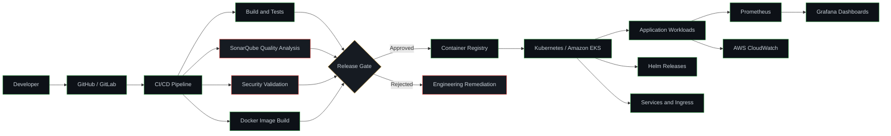
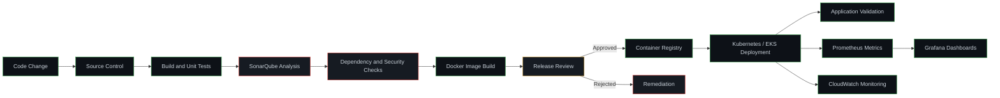

# Lingaraj Ayli

### Senior DevOps Engineer · DevSecOps · Platform Engineering

Building secure, reliable, observable, and scalable infrastructure through automation.

  
  
  

---

## Professional Summary

DevOps and DevSecOps Engineer experienced in cloud infrastructure, Infrastructure as Code, container platforms, CI/CD automation, observability, database services, security integration, and production operations.

I focus on designing and operating engineering platforms that are:

- automated and reproducible
- secure by design
- observable and operationally maintainable
- documented for engineering and operations teams
- built for controlled change, troubleshooting, and recovery

My portfolio demonstrates modular Terraform development, AWS infrastructure automation, CI/CD workflows, Kubernetes operations, DevSecOps controls, monitoring, database migration, and production-oriented documentation.

---

## Engineering Overview

<table>
<tr>
<td width="50%" valign="top">

### Core Capabilities

- AWS infrastructure automation
- Infrastructure as Code with Terraform
- CI/CD pipeline engineering
- Docker and Kubernetes operations
- Amazon EKS administration
- DevSecOps pipeline integration
- Monitoring and observability
- Linux administration
- Database migration automation
- Production troubleshooting

</td>
<td width="50%" valign="top">

### Engineering Priorities

- Reusable infrastructure modules
- Secure configuration defaults
- Least-privilege access
- Automated validation and quality gates
- Reliable deployment workflows
- Centralized metrics and dashboards
- Controlled infrastructure changes
- Operational runbooks
- Disaster recovery readiness
- Evidence-based incident analysis

</td>
</tr>
</table>

---

## Technical Expertise

| Domain | Technologies and Capabilities |
|---|---|
| **Cloud Infrastructure** | AWS, EC2, IAM, VPC, S3, RDS, EKS, AWS DMS |
| **Infrastructure as Code** | Terraform, reusable modules, environment separation |
| **Configuration Management** | Ansible |
| **Containers and Orchestration** | Docker, Kubernetes, Amazon EKS, Helm |
| **CI/CD and Build Automation** | GitLab CI/CD, GitHub Actions, Jenkins, Maven |
| **DevSecOps and Security** | SonarQube, SonarLint, Snyk, Checkov, GitLeaks, OWASP ZAP, Threat Dragon |
| **Secrets Management** | HashiCorp Vault, AWS Secrets Manager |
| **Observability** | Prometheus, Grafana, AWS CloudWatch |
| **Automation and Scripting** | Bash, Shell, Python, YAML |
| **Databases** | PostgreSQL, MySQL, Amazon RDS, AWS DMS |
| **Source Control and Collaboration** | Git, GitHub, GitLab, JIRA, Slack |
| **Operating Systems** | Linux, Windows |
| **Security and Governance** | IAM, MFA, SSL/TLS, Security Groups, NACLs, SOC 1, SOC 2, IRAP, GDPR, NIST |

---

## Tools and Technologies

  
  
  
  
  
  
  
  

  
  
  
  
  
  
  

  
  
  
  
  
  
  
  

  
  
  
  
  
  

  
  
  
  
  
  

---

## Featured Projects

### Terraform AWS Infrastructure

A modular AWS infrastructure project demonstrating production-oriented Infrastructure as Code practices.

**Engineering highlights**

- reusable Terraform modules
- environment-specific configuration
- AWS networking, compute, storage, IAM, and database components
- automated formatting and validation
- GitHub Actions workflow integration
- secure handling of state and sensitive configuration
- documented repository structure
- production-oriented engineering decisions

**Technologies**

`Terraform` `AWS` `GitHub Actions` `Git`

---

### DevSecOps Platform

A local-first DevSecOps platform connecting application delivery, infrastructure automation, security controls, Kubernetes, and observability.

**Engineering highlights**

- containerized application delivery
- CI/CD automation and quality gates
- Kubernetes deployment and operations
- Infrastructure as Code
- source-code and dependency analysis
- secrets and configuration protection
- metrics, dashboards, and alerting
- incident investigation and operational documentation

**Technologies**

`Linux` `Docker` `Kubernetes` `Terraform` `GitHub Actions` `GitLab CI/CD` `Jenkins` `SonarQube` `Prometheus` `Grafana`

---

## Platform Architecture

---

## Secure Delivery Lifecycle

---

## Portfolio Roadmap

| Project | Engineering Skills | Status |
|---|---|---|
| [Terraform AWS Infrastructure](https://github.com/lingarajayli/terraform-aws-infrastructure) | Terraform, AWS, reusable modules, GitHub Actions | Active |
| [DevSecOps Platform](https://github.com/lingarajayli/devsecops-platform) | Linux, Docker, Kubernetes, CI/CD, DevSecOps | Active |
| Containerized Application | Docker, Linux, NGINX, application delivery | Planned |
| Secure CI/CD Pipeline | Jenkins, GitLab CI/CD, GitHub Actions, SonarQube | Planned |
| Kubernetes and EKS Lab | Kubernetes, EKS, Helm, monitoring | Planned |
| Observability Lab | Prometheus, Grafana, CloudWatch | Planned |
| Ansible Automation Lab | Ansible, Linux, Bash | Planned |
| Database Migration Lab | AWS DMS, RDS, PostgreSQL, MySQL | Planned |

---

## Engineering Principles

<table>
<tr>
<td width="50%" valign="top">

### Secure by Design

- least-privilege IAM
- MFA and strong access controls
- secure configuration defaults
- secrets management
- no credentials in source control
- automated security validation
- source-code and dependency analysis
- infrastructure security checks
- auditable delivery workflows
- defence in depth

</td>
<td width="50%" valign="top">

### Reliable by Design

- Infrastructure as Code
- reusable automation
- repeatable environments
- controlled deployments
- centralized monitoring
- measurable system health
- documented recovery procedures
- operational runbooks
- evidence-based troubleshooting
- continuous improvement

</td>
</tr>
</table>

---

## Currently Building With

These technologies represent my active learning and lab-development direction and are presented separately from my established professional stack.

  
  
  
  
  
  
  

- Azure infrastructure fundamentals
- Azure Kubernetes Service operations
- GitOps deployment practices
- container and filesystem scanning with Trivy
- Kubernetes policy enforcement with Kyverno
- centralized log aggregation with Loki
- local AI-assisted DevOps workflows using Ollama

---

## Current Development Focus

- advanced Kubernetes and EKS troubleshooting
- Terraform module development
- Helm-based application packaging
- CI/CD security and quality controls
- AWS networking and IAM
- monitoring with Prometheus, Grafana, and CloudWatch
- database migration using AWS DMS
- secrets management with Vault
- Azure and AKS labs
- GitOps workflow design
- Kubernetes policy enforcement
- AI-assisted operations using local models

---

## GitHub Activity

 

 

> Language statistics represent repository composition and do not indicate overall engineering proficiency.

---

## Open to Opportunities

I am interested in roles involving:

- Senior DevOps Engineering
- DevSecOps Engineering
- Site Reliability Engineering
- Platform Engineering
- Cloud Infrastructure Engineering
- Kubernetes and EKS Operations
- Infrastructure Automation
- CI/CD Engineering

### Reliable infrastructure. Secure delivery. Measurable operations.

